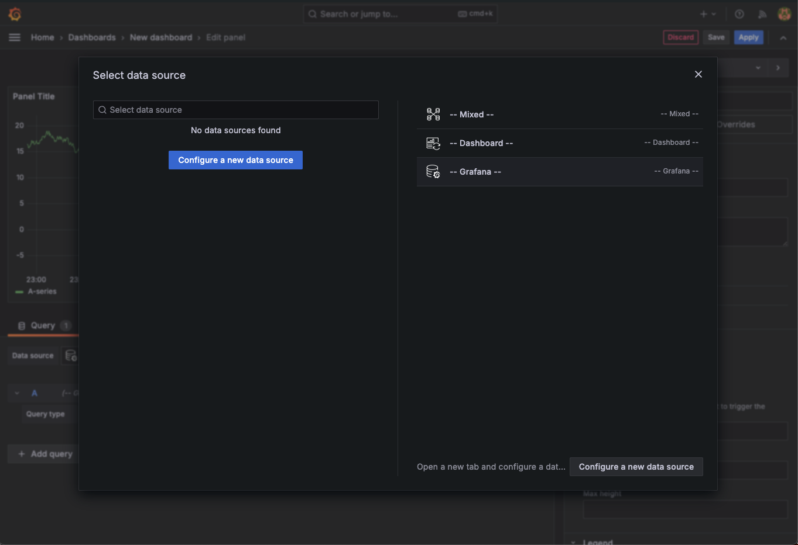

# UpCommerce

## Step 1: Deploy everything with MiniKube

## Step 2: Investigate the deployment errors:
Upon investigating the deployment status of the UpCommerce app, it was discovered that the `upcommerce-app-two` service was failing, and not ready as exemplified by running `kubectl get deployment -n sre` over the Kubernetes cluster to see all of the services:

```bash
NAME                                READY   UP-TO-DATE   AVAILABLE   AGE
grafana                             1/1     1            1           91s
prometheus-kube-state-metrics       1/1     1            1           109s
prometheus-prometheus-pushgateway   1/1     1            1           109s
prometheus-server                   1/1     1            1           109s
upcommerce-app-two                  0/1     1            0           12s
```

This is what it looks like in the terminal:


## Step 3: Review the services:

Running: `get svc -n sre`

Output:

```bash
NAME                                  TYPE        CLUSTER-IP       EXTERNAL-IP   PORT(S)          AGE
grafana                               ClusterIP   10.104.120.85    <none>        80/TCP           10m
prometheus-alertmanager               ClusterIP   10.100.201.123   <none>        9093/TCP         10m
prometheus-alertmanager-headless      ClusterIP   None             <none>        9093/TCP         10m
prometheus-kube-state-metrics         ClusterIP   10.99.144.255    <none>        8080/TCP         10m
prometheus-prometheus-node-exporter   ClusterIP   10.100.117.36    <none>        9100/TCP         10m
prometheus-prometheus-pushgateway     ClusterIP   10.106.216.235   <none>        9091/TCP         10m
prometheus-server                     ClusterIP   10.108.56.245    <none>        80/TCP           10m
upcommerce-service-two                NodePort    10.105.98.40     <none>        5000:32069/TCP   8m48s
```

As seen, the `upcommerce-service-two` is supposed to be deployed to port 5000, but it is not seen in the list of available ports:


## Step 4: Log into Grafana to debug
(Port 3000)

```bash
kubectl port-forward service/upcommerce-service-two 32069:5000 -n sre
error: unable to forward port because pod is not running. Current status=Pending
```

The port forwarding cannot execute because the pod is not running to do this.

Log into Grafana on port 3000 by going to the qualified URL in Ports:


Once logged in, it looks like this:


Create a dashboard in the hamburger menu dropdown in the top left:





Choose port 9090 (from Codespaces Ports):
- Make sure to change visibility of port 9090 from private to public


Port should connect now:


## Step 5: Log into Alerts Dashboard to debug
(Port 9093)


The issue erroring the deployment is:
```
description:	node is low on memory. Only 59.2263430920957% left
host:	
summary:	Host is low on memory. Only 59.2263430920957% left
```

and


```
description:	Pod sre/upcommerce-app-two-56cff9c64d-gsfn4 has been in a non-ready state for longer than 5 minutes.
summary:	Pod has been in a non-ready state for more than 2 minutes.
```


Further inside of the terminal: `kubectl describe pod upcommerce-app-two -n sre | grep -A5 Events`

Outputs the below:
```bash
Events:
  Type     Reason            Age                  From               Message
  ----     ------            ----                 ----               -------
  Warning  FailedScheduling  2m37s (x9 over 42m)  default-scheduler  0/1 nodes are available: 1 Insufficient cpu. preemption: 0/1 nodes are available: 1 No preemption victims found for incoming pod..
```


